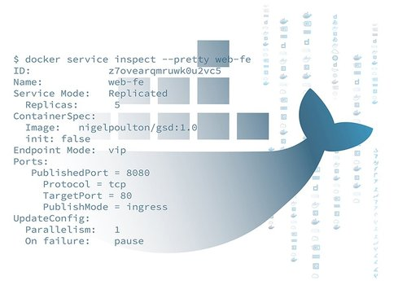
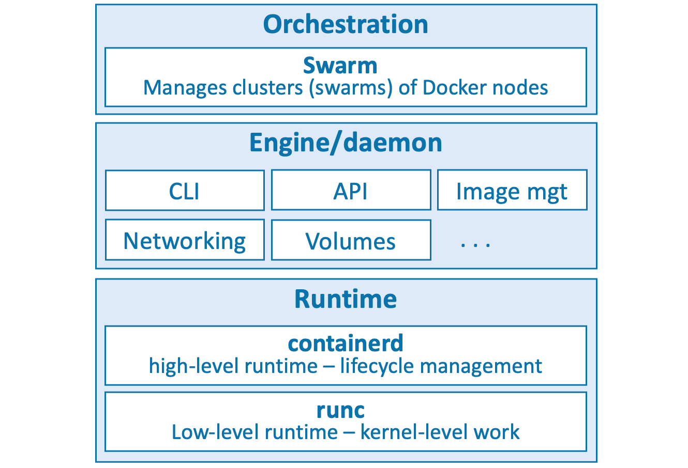

# Docker Deep Dive



# 1: Contenedores desde 30,000 pies de altura

**Introducción y contexto histórico**

Los contenedores se han consolidado como una tecnología fundamental en el mundo de la informática moderna. Este capítulo explica por qué existen los contenedores, qué ventajas ofrecen y dónde se pueden aplicar.

**Los malos viejos tiempos**

Históricamente, las aplicaciones empresariales son críticas: su falla puede significar la caída o quiebra de la empresa. Tradicionalmente, cada aplicación se ejecutaba en un servidor físico dedicado, debido a limitaciones técnicas de los sistemas operativos (Windows, Linux) que impedían correr múltiples aplicaciones en un solo servidor de forma segura.

Esto generaba que cada nueva aplicación implicara comprar un servidor nuevo y sobredimensionado, debido a la incertidumbre sobre los requisitos de rendimiento. Como resultado, se desperdiciaba mucho capital y recursos, con servidores operando a solo un 5–10% de su capacidad.

**¡Hola VMware!**

VMware revolucionó este panorama con las máquinas virtuales (VMs), que permitían ejecutar múltiples aplicaciones seguras en un mismo servidor al virtualizar el hardware. Esto aumentó la eficiencia y redujo la necesidad de adquirir nuevos servidores.

**Limitaciones de las máquinas virtuales (VMs)**

Aunque las VMs aportaron mejoras, tienen inconvenientes:

* Cada VM requiere un sistema operativo (OS) completo, consumiendo recursos (CPU, RAM) que podrían destinarse a las aplicaciones.
* Cada OS requiere mantenimiento, parches y a veces licencias, aumentando costos y complejidad.
* Las VMs son lentas para arrancar.
* La portabilidad entre hipervisores y nubes no es óptima, dificultando la migración de cargas de trabajo.

**¡Hola contenedores!**

Las empresas tecnológicas a gran escala, como Google, comenzaron a usar contenedores para superar las limitaciones de las VMs. Un contenedor es conceptualmente similar a una VM, pero comparte el OS del host, en lugar de requerir uno propio.

Esto implica:

* Menor consumo de recursos (CPU, RAM, almacenamiento).
* Reducción de costos en licencias y mantenimiento.
* Arranque mucho más rápido.
* Mayor portabilidad: mover contenedores entre diferentes entornos (laptop, nube, VMs, hardware físico) es sencillo.

**Contenedores Linux**

El modelo moderno de contenedores se originó en Linux gracias a tecnologías del kernel como:

* **Namespaces**: aislamiento de recursos del sistema.
* **Control groups (cgroups)**: limitación y contabilización de recursos.
* **Capabilities**: control granular de privilegios.
* **Docker**: herramienta que simplifica el uso y gestión de contenedores.

Google fue un actor clave en desarrollar estas tecnologías. El ecosistema de contenedores modernos depende de estas bases.

Antes de Docker, los contenedores eran complejos y estaban fuera del alcance para la mayoría, pero Docker democratizó su uso.

**Tecnologías previas similares a contenedores**

Aunque Docker es el foco, existen tecnologías similares anteriores, como:

* System/360 (mainframes)
* BSD Jails
* Solaris Zones

**¡Hola Docker!**

Docker es la herramienta que hizo accesible el uso de contenedores Linux para usuarios y empresas, simplificando su creación y gestión.

**Docker y Windows**

Microsoft ha integrado soporte para contenedores en Windows, incluyendo:

* **Windows containers**: corren aplicaciones Windows y requieren un host con kernel Windows (Windows 10, 11 y versiones modernas de Windows Server).
* **Linux containers en Windows**: con WSL 2 (Windows Subsystem for Linux), cualquier host Windows puede correr contenedores Linux, lo que facilita desarrollo y pruebas.

Sin embargo, la mayoría de los contenedores siguen siendo Linux porque:

* Son más ligeros y rápidos.
* Existe un ecosistema más amplio de herramientas.

Este libro se centra en contenedores Linux.

**Windows containers vs Linux containers**

Los contenedores comparten el kernel del host:

* Aplicaciones Windows necesitan kernel Windows.
* Aplicaciones Linux necesitan kernel Linux.

Gracias a WSL 2, es posible ejecutar contenedores Linux en Windows.

**¿Contenedores en Mac?**

No existen contenedores nativos Mac OS, pero es común usar Docker Desktop que ejecuta contenedores Linux dentro de una VM Linux ligera. Esto es popular entre desarrolladores Mac.

**¿Y Kubernetes?**

Kubernetes es un sistema open-source desarrollado por Google que se ha convertido en el orquestador estándar para aplicaciones en contenedores.

* “Aplicación en contenedor” se refiere a una aplicación empaquetada y ejecutada como contenedor.
* Kubernetes usaba Docker como runtime por defecto, pero ahora, gracias a la Container Runtime Interface (CRI), puede usar otros runtimes, siendo **containerd** (la parte de Docker responsable de iniciar y detener contenedores) el más común.

---


# 2: Docker

**Introducción: qué es Docker**

Docker es una palabra que puede referirse a dos cosas distintas pero relacionadas:

1. **Docker, Inc.**: la empresa que desarrolló y sigue evolucionando la tecnología.
2. **Docker**: la tecnología de contenedores en sí misma.

---

### Docker — Versión rápida (TL;DR)

Docker es un software que se ejecuta tanto en Linux como en Windows, diseñado para crear, gestionar y orquestar contenedores. Está compuesto por varias herramientas del proyecto open-source **Moby**. Docker, Inc. es la empresa que desarrolló esta tecnología y continúa facilitando su uso, especialmente para ejecutar código desde un portátil hasta la nube.

---

### Docker, Inc.

Docker, Inc. es una empresa tecnológica con sede en San Francisco, fundada por **Solomon Hykes**, desarrollador franco-estadounidense, que ya no forma parte de la compañía.

* Originalmente, Docker, Inc. era **dotCloud**, un proveedor de plataforma como servicio (**PaaS**).
* DotCloud estaba construido sobre contenedores Linux y desarrolló internamente una herramienta para crear y gestionar contenedores llamada **Docker**.
* El nombre "Docker" proviene del término británico para "estibador" (dock worker), la persona que carga y descarga mercancía en los barcos.
* En 2013, dotCloud eliminó su negocio PaaS, se renombró como Docker, Inc. y enfocó todos sus esfuerzos en promover la tecnología de contenedores Docker.
* En adelante, en este libro **Docker, Inc.** se usará para referirse a la empresa, y **Docker** para la tecnología.

---

### La tecnología Docker

Docker como tecnología se compone principalmente de tres elementos clave:

1. **El runtime** (tiempo de ejecución).
2. **El daemon** (motor o engine).
3. **El orquestador**.



---

#### El runtime

El runtime es la capa más baja, responsable de iniciar y detener contenedores, construyendo elementos esenciales del sistema operativo como **namespaces** y **cgroups**.

* Docker usa un modelo de runtime por niveles:

  * **Runtime de bajo nivel:** **runc**. Es la implementación de referencia de la especificación **OCI runtime-spec** de la **Open Containers Initiative (OCI)**. Interactúa directamente con el OS y arranca o detiene contenedores. Cada contenedor se ejecuta en una instancia de **runc**.
  * **Runtime de alto nivel:** **containerd**. Administra el ciclo de vida completo del contenedor, incluyendo la descarga de imágenes y el manejo de instancias de **runc**. Es un proyecto graduado por la **Cloud Native Computing Foundation (CNCF)**, utilizado tanto por Docker como por Kubernetes.

En una instalación típica, **containerd** está siempre activo y coordina con **runc** para arrancar y detener contenedores, mientras que **runc** es efímero y termina una vez el contenedor inicia.

---

#### El daemon de Docker

El **Docker daemon** (**dockerd**) funciona encima de **containerd**, realizando tareas de alto nivel:

* Expone la **Docker API**.
* Gestiona imágenes, volúmenes y redes.
* Facilita una interfaz estándar y accesible que abstrae la complejidad del runtime.

---

#### El orquestador: Docker Swarm

Docker soporta de forma nativa la gestión de clústeres (grupos de nodos) llamados **swarms** mediante **Docker Swarm**.

* Es sencillo de usar y ampliamente adoptado en producción.
* Más fácil de instalar y gestionar que Kubernetes.
* Sin embargo, carece de muchas funcionalidades avanzadas y del ecosistema robusto que ofrece Kubernetes.

---

### La Open Container Initiative (OCI)

La **Open Containers Initiative (OCI)** es un organismo de gobernanza que busca estandarizar componentes clave de bajo nivel en la infraestructura de contenedores, especialmente:

* El formato de imagen (**image format**).
* El runtime del contenedor (**container runtime**).

---

#### Historia y contexto

* Al crecer la adopción de Docker, surgieron tensiones y competencia con proyectos como **CoreOS**, que promovía un estándar alternativo llamado **appc** y su runtime **rkt**.
* La existencia de múltiples estándares fragmentaba el ecosistema, generando confusión y ralentizando la adopción.
* Como respuesta, todas las partes se unieron para formar la **OCI**, un consejo ágil para gobernar los estándares de contenedores.

---

#### Especificaciones OCI publicadas

Actualmente, la OCI ha lanzado tres especificaciones principales:

* **image-spec**: define el formato estándar para las imágenes de contenedores.
* **runtime-spec**: define el estándar para el runtime del contenedor.
* **distribution-spec**: especifica la distribución de imágenes.

Estas especificaciones son comparables a estandarizar el tamaño de las vías de tren, permitiendo que fabricantes independientes construyan trenes y vagones compatibles, asegurando interoperabilidad.

* Las versiones modernas de Docker y Docker Hub cumplen con estas especificaciones.
* La OCI funciona bajo la **Linux Foundation**.


---


# 3: Instalando Docker

Existen muchas formas y lugares para instalar Docker: en Windows, Mac y Linux.
Puedes instalarlo en la nube, en servidores locales (on premises) o en tu portátil. También hay instalaciones manuales, mediante scripts o con asistentes gráficos…

Pero no dejes que eso te intimide. Todas son realmente fáciles, y una simple búsqueda de “how to install docker on `<inserta tu opción aquí>`” revelará instrucciones actualizadas y fáciles de seguir.
Por ello, no gastaremos demasiado espacio aquí. Cubriremos lo siguiente:

* **Docker Desktop**
  – Windows
  – MacOS
* **Multipass**
* Instalaciones de servidor en:
  – Linux
* **Play with Docker**

---

### **Docker Desktop**

Docker Desktop es una aplicación de escritorio de Docker, Inc. que facilita enormemente el trabajo con contenedores. Incluye el motor de Docker (Docker engine), una interfaz gráfica pulida y un sistema de extensiones con un marketplace.
Estas extensiones añaden funciones muy útiles, como el escaneo de imágenes en busca de vulnerabilidades o la gestión sencilla de imágenes y espacio en disco.

Docker Desktop es gratuito para fines educativos, pero deberás pagar si lo usas para trabajo y tu empresa tiene más de 250 empleados o más de 10 millones USD de ingresos anuales.

Funciona en versiones de 64 bits de Windows 10, Windows 11, MacOS y Linux.

Una vez instalado, tendrás un entorno Docker completamente funcional ideal para desarrollo, pruebas y aprendizaje. Incluye **Docker Compose** y hasta permite habilitar un clúster Kubernetes de un solo nodo para fines de estudio.

En Windows, Docker Desktop puede ejecutar contenedores nativos de Windows y contenedores Linux.
En Mac y Linux, solo puede ejecutar contenedores Linux.

A continuación, veremos el proceso de instalación en Windows y MacOS.

---

#### **Requisitos previos para Windows**

Docker Desktop en Windows requiere:

* Versión de 64 bits de Windows 10/11
* Soporte de virtualización por hardware habilitado en la BIOS del sistema
* **WSL 2** (Windows Subsystem for Linux, versión 2)

⚠️ Ten mucho cuidado al cambiar configuraciones en la BIOS.

---

#### **Instalando Docker Desktop en Windows 10 y 11**

Busca en internet o pide a tu asistente de IA cómo “install Docker Desktop on Windows”. Esto te llevará a la página de descarga correspondiente, donde podrás obtener el instalador y seguir las instrucciones.
Es posible que debas instalar y habilitar el backend WSL 2.

Una vez completada la instalación, puede que tengas que iniciar manualmente Docker Desktop desde el menú Inicio de Windows. Puede tardar un minuto en arrancar; podrás seguir el progreso gracias al icono animado de la ballena en la barra de tareas.

Cuando esté en ejecución, abre una terminal y ejecuta:

```bash
$ docker version
```

**Salida de ejemplo:**

```
Client:
Cloud integration: v1.0.31
Version: 20.10.23
API version: 1.41
Go version: go1.18.10
Git commit: 7155243
Built: Thu Jan 19 01:20:44 2023
OS/Arch: linux/amd64
Context: default
Experimental: true

Server:
Engine:
Version: 20.10.23
<Snip>
OS/Arch: linux/amd64
Experimental: true
```

Observa que el **Server** muestra `OS/Arch: linux/amd64`. Esto se debe a que la instalación por defecto trabaja con contenedores Linux.

Puedes cambiar a contenedores Windows haciendo clic derecho en el icono de la ballena en el área de notificaciones y seleccionando **Switch to Windows containers…**.
Los contenedores Linux seguirán ejecutándose en segundo plano, pero no podrás gestionarlos hasta que vuelvas al modo Linux.

Al ejecutar nuevamente `docker version`, en la sección **Server** verás `OS/Arch: windows/amd64`.

Ahora podrás ejecutar y gestionar contenedores que corran aplicaciones Windows.
¡Listo! Docker está funcionando en tu máquina Windows.

---

### **Instalando Docker Desktop en Mac**

Docker Desktop para Mac es equivalente al de Windows: un producto empaquetado con interfaz gráfica que instala Docker en un único motor, ideal para desarrollo local. También permite activar un clúster Kubernetes de un solo nodo.

En Mac, Docker Desktop instala todos los componentes de Docker en una **máquina virtual ligera de Linux (VM)** que expone la API de forma transparente al entorno local.
Esto significa que puedes usar los comandos Docker habituales en tu terminal sin notar que todo corre dentro de una VM Linux.
Por esta razón, en Mac solo se pueden usar contenedores Linux, lo cual está bien ya que la mayoría del trabajo con contenedores ocurre en Linux.

La forma más sencilla de instalarlo es buscar “install Docker Desktop on MacOS” y seguir el instalador.

Tras instalar, quizá tengas que iniciarlo desde **Launchpad**. Al arrancar, verás el icono animado de la ballena en la barra superior.
Abre una terminal y ejecuta:

```bash
$ docker version
```

**Salida de ejemplo:**

```
Client:
Cloud integration: v1.0.31
Version: 23.0.5
API version: 1.42
<Snip>
OS/Arch: darwin/arm64
Context: desktop-linux

Server: Docker Desktop 4.19.0 (106363)
Engine:
Version: dev
API version: 1.43 (minimum version 1.12)
<Snip>
OS/Arch: linux/arm64
Experimental: false
...
```

El cliente (`Client`) es una aplicación nativa para MacOS (Darwin kernel), mientras que el servidor (`Server`) corre dentro de la VM Linux.

Ya puedes usar Docker en Mac.

---

### **Instalando Docker con Multipass**

Multipass es una herramienta gratuita para crear VMs Linux tipo “cloud” en Linux, Mac o Windows. Es ideal para pruebas rápidas de Docker.

Instálalo desde: [https://multipass.run/install](https://multipass.run/install)

Comandos básicos:

```bash
$ multipass launch
$ multipass ls
$ multipass shell
```

Para crear una VM llamada `node1` con Docker preinstalado:

```bash
$ multipass launch docker --name node1
```

Lista las VMs:

```bash
$ multipass ls
```

Conéctate a la VM:

```bash
$ multipass shell node1
```

Para eliminarla:

```bash
$ multipass delete node1
$ multipass purge
```

---

### **Instalando Docker en Linux**

Hay múltiples formas de hacerlo; la recomendada es consultar la documentación más reciente.
Ejemplo en Ubuntu 22.04 LTS:

1. Eliminar paquetes existentes:

```bash
$ sudo apt-get remove docker docker-engine docker.io containerd runc
```

2. Actualizar e instalar dependencias:

```bash
$ sudo apt-get update
$ sudo apt-get install ca-certificates curl gnupg
```

3. Añadir clave GPG de Docker:

```bash
$ sudo install -m 0755 -d /etc/apt/keyrings
$ curl -fsSL https://download.docker.com/linux/ubuntu/gpg | sudo gpg --dearmor -o /etc/apt/keyrings/docker.gpg
$ sudo chmod a+r /etc/apt/keyrings/docker.gpg
```

4. Configurar el repositorio:

```bash
$ echo "deb [arch=$(dpkg --print-architecture) signed-by=/etc/apt/keyrings/docker.gpg] \
https://download.docker.com/linux/ubuntu $(. /etc/os-release && echo "$VERSION_CODENAME") stable" \
| sudo tee /etc/apt/sources.list.d/docker.list > /dev/null
```

5. Instalar desde el repo oficial:

```bash
$ sudo apt-get update
$ sudo apt-get install docker-ce docker-ce-cli containerd.io docker-buildx-plugin docker-compose-plugin
```

Verifica:

```bash
$ sudo docker --version
$ sudo docker info
```

---

### **Play with Docker**

**Play with Docker (PWD)** es un entorno Docker en línea y gratuito con duración de 4 horas, que permite crear varios nodos y hasta formar un **swarm**.
Entra en: [https://labs.play-with-docker.com/](https://labs.play-with-docker.com/)

---


# 4: The big picture

El objetivo de este capítulo es ofrecerte una visión general rápida de qué trata Docker antes de profundizar en capítulos posteriores.
Dividiremos este capítulo en dos partes:

* La perspectiva de Ops
* La perspectiva de Dev

En la sección de Ops, descargaremos una imagen, iniciaremos un contenedor nuevo, accederemos a él, ejecutaremos un comando dentro y luego lo destruiremos.
En la sección de Dev, nos enfocaremos más en la aplicación. Clonaremos código desde GitHub, inspeccionaremos un Dockerfile, contenedorizaremos la app y la ejecutaremos como contenedor.

Estas dos secciones te darán una buena idea de qué es Docker y cómo encajan sus componentes principales. Se recomienda leer ambas para obtener las perspectivas de desarrollo y operaciones. ¿DevOps, alguien?

No te preocupes si algunos conceptos son nuevos. No pretendemos hacerte experto en este capítulo, sino darte una sensación general para que, cuando entremos en detalles, ya tengas una idea clara del panorama.

Para seguir los ejemplos, solo necesitas un host Docker con conexión a internet. Recomiendo Docker Desktop para Mac o Windows, aunque los ejemplos funcionan en cualquier sistema con Docker instalado. Usaremos ejemplos tanto con contenedores Linux como Windows.

Si no puedes instalar software ni tienes acceso a nube pública, otra excelente opción es **Play With Docker (PWD)**, un entorno Docker online y gratuito de 4 horas. Solo apunta tu navegador a [https://labs.play-with-docker.com/](https://labs.play-with-docker.com/) y listo (necesitarás una cuenta Docker Hub o GitHub para iniciar sesión).

En este capítulo, usaremos indistintamente “Docker host” o “Docker node” para referirnos al sistema donde corre Docker.

---

#### The Ops Perspective

Al instalar Docker, obtienes dos componentes principales:

* El cliente Docker
* El motor Docker (a veces llamado “daemon”)

El motor implementa el runtime, API y todo lo necesario para ejecutar contenedores.
En una instalación típica de Linux, el cliente se comunica con el daemon vía un socket local Unix en `/var/run/docker.sock`. En Windows, usa un pipe nombrado `npipe:////./pipe/docker_engine`.

Para verificar que cliente y daemon están activos y comunicándose, usa:

```bash
$ docker version
```

**Ejemplo de salida:**

```
Client: Docker Engine - Community
Version: 24.0.0
API version: 1.43
Go version: go1.20.4
Git commit: 98fdcd7
Built: Mon May 15 18:48:45 2023
OS/Arch: linux/arm64
Context: default

Server: Docker Engine - Community
Engine:
Version: 24.0.0
API version: 1.43 (minimum version 1.12)
Go version: go1.20.4
Git commit: 1331b8c
Built: Mon May 15 18:48:45 2023
OS/Arch: linux/arm64
Experimental: false
```

Si obtienes respuesta tanto del cliente como del servidor, estás listo para continuar.

Si usas Linux y recibes error del servidor, verifica que Docker esté corriendo y prueba con `sudo docker version`. Si funciona con `sudo`, agrega tu usuario al grupo `docker` o antepón siempre `sudo` a los comandos Docker.

---

#### Imágenes

Piensa en una imagen Docker como un objeto que contiene un sistema de archivos de un OS, una aplicación y todas sus dependencias. Para operaciones, es parecido a una plantilla de máquina virtual (VM). Para desarrollo, es como una clase en programación.

Ejecuta:

```bash
$ docker images
```

Si es un host Docker nuevo o PWD, probablemente no veas imágenes listadas.

Para obtener imágenes en tu host Docker, debes “tirarlas” (pull). Por ejemplo, baja la imagen de Ubuntu:

```bash
$ docker pull ubuntu:latest
```

Verás que Docker descarga varias capas y finaliza mostrando la imagen. Luego:

```bash
$ docker images
```

Deberías ver algo así:

```
REPOSITORY TAG IMAGE ID CREATED SIZE
ubuntu latest dfd64a3b4296 1 minute ago 106MB
```

Más adelante profundizaremos dónde se almacena la imagen y qué contiene. Por ahora, basta saber que incluye una versión reducida del sistema de archivos de Ubuntu y utilidades básicas.

Si bajas una imagen de una app, como `nginx:latest`, tendrás el OS mínimo y el código para correr NGINX.

Cada imagen tiene un ID único. Puedes usar el nombre o la parte inicial del ID para referenciarla, mientras sea único.

---

#### Contenedores

Con una imagen local, puedes ejecutar un contenedor con:

```bash
$ docker run -it ubuntu:latest /bin/bash
```

Fíjate que tu prompt cambia porque ahora estás dentro del contenedor con una shell interactiva (`-it`).

`docker run` arranca un contenedor nuevo. Las opciones `-it` indican que sea interactivo y que conecte tu terminal con el contenedor. El contenedor se basa en la imagen `ubuntu:latest` y corre el comando `/bin/bash`.

Dentro, corre:

```bash
root@6dc20d508db0:/# ps -elf
```

Verás dos procesos:

* PID 1: el `/bin/bash` que lanzaste
* PID 9: el comando `ps -elf` que acabas de ejecutar

El resto de procesos del host no están dentro del contenedor, que es un entorno aislado.

Presiona `Ctrl-P Q` para salir del contenedor sin detenerlo. Volverás a la terminal del host.

Ejecuta en el host:

```bash
$ docker ps
```

Verás tu contenedor aún corriendo, con su nombre generado, cuánto tiempo lleva activo, etc.

---

#### Volver a entrar a un contenedor

Puedes reconectarte a un contenedor en ejecución con:

```bash
$ docker exec -it <nombre_o_id_del_contenedor> bash
```

Ejemplo:

```bash
$ docker exec -it vigilant_borg bash
```

Cambiará tu prompt al del contenedor otra vez.

Sal con `Ctrl-P Q` y vuelve al host.

Para detener y eliminar el contenedor:

```bash
$ docker stop vigilant_borg
$ docker rm vigilant_borg
```

Confirma que el contenedor desapareció con:

```bash
$ docker ps -a
```

¡Felicidades! Acabas de bajar una imagen, lanzar un contenedor, conectarte, ejecutar comandos, detenerlo y eliminarlo.

---

#### The Dev Perspective

Los contenedores giran en torno a las aplicaciones.
Vamos a clonar una app, ver su Dockerfile, construirla y correrla como contenedor.

Clona la app Node.js desde GitHub:

```bash
$ git clone https://github.com/nigelpoulton/psweb.git
```

Entra al directorio y lista archivos:

```bash
$ cd psweb
$ ls -l
```

Verás archivos como `Dockerfile`, `app.js`, `package.json`, etc.

El Dockerfile contiene instrucciones para construir la imagen:

```Dockerfile
FROM alpine
LABEL maintainer="nigelpoulton@hotmail.com"
RUN apk add --update nodejs nodejs-npm
COPY . /src
WORKDIR /src
RUN npm install
EXPOSE 8080
ENTRYPOINT ["node", "./app.js"]
```

Cada línea indica a Docker qué hacer: partir de Alpine Linux, instalar Node.js, copiar archivos, instalar dependencias, exponer el puerto 8080 y lanzar la app.

Ahora construye la imagen con:

```bash
$ docker build -t test:latest .
```

Este comando crea una imagen llamada `test` con la etiqueta `latest` usando el Dockerfile del directorio actual (`.`).

---

### Play with Docker (PWD)

**Play with Docker** es un entorno Docker online gratuito, con sesiones de hasta 4 horas, que permite crear múltiples nodos y formar un **swarm**.

Sitio web: [https://labs.play-with-docker.com/](https://labs.play-with-docker.com/)

---


---

# 5: El motor Docker (The Docker Engine)

### Arquitectura antigua de Docker y eliminación de LXC

En los primeros tiempos, Docker dependía de LXC (Linux Containers) para gestionar los contenedores. Esta dependencia fue problemática por dos razones principales:

* **LXC es específico de Linux**, lo que limitaba la capacidad de Docker para ser multiplataforma.
* Confiar en una herramienta externa para una función tan crítica representaba un riesgo para la estabilidad y evolución del proyecto.

Para superar esto, Docker, Inc. desarrolló **libcontainer**, una herramienta propia diseñada para ser independiente de la plataforma y permitir a Docker acceder directamente a los componentes fundamentales del kernel del sistema operativo anfitrión. Desde Docker versión 0.9, libcontainer reemplazó a LXC como driver de ejecución predeterminado.

---

### Eliminación del daemon monolítico de Docker

Con el tiempo, el daemon monolítico de Docker se volvió un problema porque:

1. Dificultaba la innovación.
2. Se volvió más lento.
3. No respondía bien a las necesidades del ecosistema.

Para resolverlo, Docker, Inc. inició un proceso para descomponer el daemon en herramientas especializadas y modulares siguiendo la filosofía Unix de crear pequeños programas que puedan combinarse para formar sistemas más complejos. El resultado fue que todo el código relacionado con la ejecución y el runtime de contenedores fue extraído y refactorizado en componentes más pequeños.

---

### Influencia del Open Container Initiative (OCI)

Paralelamente, el **Open Container Initiative (OCI)** definía estándares para contenerización, principalmente dos especificaciones publicadas en julio de 2017:

* **Image Spec** (especificación de imagen)
* **Container Runtime Spec** (especificación del runtime de contenedores)

Estas especificaciones buscan estabilidad y estandarización, y Docker ha adoptado completamente estas normas desde 2016. Esto llevó a que el daemon Docker ya no contenga código de runtime de contenedores, el cual ahora se implementa en una capa OCI independiente.

Por defecto, Docker utiliza **runc** como runtime de contenedores OCI-compliant, mientras que **containerd** se encarga de presentar las imágenes Docker a runc como bundles compatibles con OCI.

---

### runc: El runtime de bajo nivel

**runc** es la implementación de referencia del runtime OCI. Originado como un CLI ligero que actúa como un wrapper para libcontainer, su único propósito es crear contenedores. Es rápido y minimalista, pero carece de funcionalidades avanzadas que ofrece el motor Docker completo. Puede ser usado directamente para crear contenedores OCI, pero no tiene la riqueza funcional del ecosistema Docker.

---

### containerd: El supervisor de ciclo de vida

**containerd** es una herramienta modular diseñada para gestionar operaciones del ciclo de vida de contenedores como iniciar, detener, pausar o eliminar. Funciona como un daemon en Linux y Windows y, desde Docker 1.11, se usa en la arquitectura Docker.

Inicialmente simple, containerd ha incorporado funcionalidades adicionales (gestión de imágenes, volúmenes, redes) para facilitar su integración en proyectos externos como Kubernetes. Estas funcionalidades son modulares y opcionales.

containerd fue desarrollado por Docker, Inc. y donado a la Cloud Native Computing Foundation (CNCF), alcanzando el estado de proyecto graduado y listo para producción.

---

### Ejemplo de creación de un contenedor

El comando típico para iniciar un contenedor es:

```bash
docker run --name ctr1 -it alpine:latest sh
```

Este comando es transformado por el cliente Docker en una llamada API que envía al daemon Docker a través del socket local (`/var/run/docker.sock` en Linux o `\pipe\docker_engine` en Windows).

El daemon, sin código de creación de contenedores, delega esta tarea a containerd mediante una API CRUD basada en gRPC. containerd no crea el contenedor directamente, sino que convierte la imagen Docker en un bundle OCI y solicita a runc que cree el contenedor.

runc interactúa con el kernel del sistema operativo para ensamblar los elementos necesarios (namespaces, cgroups) y ejecuta el proceso contenedor. Luego, runc termina su ejecución.

---

### Beneficio principal: contenedores "daemonless"

Al separar la lógica del runtime del daemon, el contenedor puede seguir funcionando independientemente del estado del daemon Docker, lo que permite actualizaciones y mantenimiento del daemon sin afectar contenedores en ejecución.

Antes, reiniciar o detener el daemon terminaba todos los contenedores en el host, lo cual era problemático en producción. Ahora, este problema está resuelto.

---

### ¿Qué es el shim?

El **shim** es un componente esencial para la arquitectura daemonless. containerd crea un proceso runc para cada contenedor, pero cuando runc finaliza tras crear el contenedor, el proceso shim asume el rol de padre del contenedor.

El shim mantiene abiertos los flujos STDIN y STDOUT para que la interacción con el contenedor no se interrumpa durante reinicios del daemon, y también comunica el estado de salida del contenedor al daemon.

---

### Implementación en Linux

En Linux, los componentes descritos existen como binarios independientes:

* `/usr/bin/dockerd`: daemon Docker
* `/usr/bin/containerd`: gestor de ciclo de vida de contenedores
* `/usr/bin/containerd-shim-runc-v2`: shim para runc
* `/usr/bin/runc`: runtime OCI de bajo nivel

Se pueden observar estos procesos en ejecución con comandos como `ps` cuando hay contenedores activos.

---

### ¿Qué funciones quedan en el daemon?

Con la modularización, el daemon mantiene funciones como:

* Gestión de imágenes (en proceso de ser transferida a containerd)
* Implementación de la API Docker
* Autenticación y seguridad
* Gestión de redes y volúmenes

El daemon continúa evolucionando para convertirse en un componente más especializado y ligero.

---


# 6: Images

### Concepto y estructura de una imagen

Una imagen en Docker funciona como un archivo manifest que contiene una lista de capas (layers) y metadatos. La aplicación y sus dependencias residen dentro de estas capas, que son totalmente independientes y no tienen conciencia de formar parte de un conjunto mayor. Cada imagen se identifica mediante un ID criptográfico (crypto ID) que es un hash del archivo manifest, mientras que cada capa tiene un crypto ID basado en el hash del contenido de dicha capa.

Esto implica que cualquier cambio en la imagen o en cualquiera de sus capas provoca una modificación en sus respectivos hashes. Por tanto, las imágenes y capas son inmutables (immutable), lo que facilita detectar cualquier alteración.

### Complicaciones con compresión y hashes

Cuando se suben (push) o descargan (pull) imágenes, las capas se comprimen para ahorrar ancho de banda y espacio en el registro (registry). Sin embargo, la compresión altera el contenido, haciendo que los hashes de contenido originales ya no coincidan tras estas operaciones.

Esto genera un problema para la verificación de integridad, como la que realiza Docker Hub, que valida cada capa subida con un hash para asegurarse de que no ha sido manipulada. Debido a la compresión, esta verificación fallaría.

La solución es el uso del "distribution hash", que es el hash calculado sobre la versión comprimida de la capa. Este hash de distribución se incluye con cada capa enviada y recibida, garantizando que la capa no fue alterada durante la transferencia.

### Imágenes multi-arquitectura (multi-architecture images)

Docker inicialmente es muy simple, pero al crecer la tecnología tuvo que adaptarse para soportar múltiples plataformas y arquitecturas (Windows, Linux, ARM, x64, PowerPC, s390x, etc.). Esto complicaba el proceso para los usuarios, quienes debían asegurarse de descargar la imagen correcta para su plataforma y arquitectura específicas.

**Definiciones clave:**

* *Arquitectura* (architecture): se refiere al tipo de CPU, como x64, ARM.
* *Plataforma* (platform): se refiere al sistema operativo (Linux, Windows) o a la combinación OS + arquitectura.

La solución fue crear imágenes multi-arquitectura: un solo tag de imagen (como `golang:latest`) puede contener versiones para diferentes combinaciones de plataforma y arquitectura. Así, al ejecutar un simple comando `docker pull golang:latest`, Docker automáticamente obtiene la imagen adecuada para la plataforma y arquitectura del host.

### Cómo funcionan las imágenes multi-arquitectura

El API del registro (Registry API) utiliza dos constructos principales:

* **Manifest lists**: una lista que indica las arquitecturas soportadas por un tag de imagen.
* **Manifests**: cada uno corresponde a una arquitectura específica e incluye la configuración de la imagen y las capas correspondientes.

Por ejemplo, para el tag `golang:latest`, el manifest list contiene entradas para Linux en x64, Linux en PowerPC, Windows en x64, Linux en ARM, etc. Cuando un cliente Docker (por ejemplo, un Raspberry Pi con Linux ARM) realiza un pull, primero obtiene el manifest list, busca la entrada correspondiente a su plataforma/arquitectura, luego descarga el manifest y, finalmente, las capas asociadas.

### Ejemplos prácticos

* En un sistema Linux ARM64:

  ```bash
  docker run --rm golang go version
  ```

  Salida:
  `go version go1.20.4 linux/arm64`

* En un sistema Windows x64:

  ```powershell
  docker run --rm golang go version
  ```

  Salida:
  `go version go1.20.4 windows/amd64`

Ambos comandos son idénticos, pero Docker gestiona automáticamente la selección de la imagen correcta.

### Inspección de manifest lists

El comando `docker manifest inspect` permite examinar el manifest list de cualquier imagen en Docker Hub. Por ejemplo:

```bash
docker manifest inspect golang | grep 'architecture\|os'
```

muestra las arquitecturas y sistemas operativos soportados, incluyendo versiones específicas de Windows.

### Creación de imágenes multi-arquitectura propias

Se pueden construir imágenes para diferentes plataformas y arquitecturas usando `docker buildx`. Por ejemplo, para crear una imagen para ARMv7 basada en un repositorio:

```bash
docker buildx build --platform linux/arm/v7 -t myimage:arm-v7 .
```

El comando puede ejecutarse en una máquina con arquitectura distinta, no es necesario usar un nodo ARMv7.

### Eliminación de imágenes (Deleting Images)

Para eliminar imágenes locales se usa el comando:

```bash
docker rmi <image_id>
```

Esto elimina la imagen y sus capas del host local. Sin embargo, capas compartidas entre varias imágenes no se eliminan hasta que todas las imágenes que las referencian sean eliminadas.

No es posible eliminar una imagen si está siendo usada por contenedores activos o detenidos, primero se deben parar y eliminar esos contenedores.

Ejemplo para eliminar varias imágenes:

```bash
docker rmi image_id1 image_id2
```

Un atajo útil para eliminar todas las imágenes es combinar:

```bash
docker rmi $(docker images -q) -f
```

Este comando obtiene todos los IDs de imágenes y las elimina forzosamente. En Windows funciona en PowerShell, no en CMD.

### Comandos clave para trabajar con imágenes

* `docker pull`: descarga imágenes de registros remotos (por defecto Docker Hub). Ejemplo:

  ```bash
  docker pull alpine:latest
  ```
* `docker images`: lista imágenes locales; con `--digests` muestra sus digests SHA256.
* `docker inspect`: muestra detalles completos de una imagen, capas y metadatos.
* `docker manifest inspect`: inspecciona manifest lists en registros remotos.
* `docker buildx`: extensión CLI para construir imágenes multi-arquitectura.
* `docker rmi`: elimina imágenes locales, pero no permite eliminar imágenes asociadas a contenedores activos o detenidos.


---

# 7: Contenedores

### Políticas de reinicio de contenedores en Docker

El capítulo comienza explicando la política de reinicio **--restart always**, la más simple y estricta. Esta política hace que Docker reinicie automáticamente un contenedor si falla o se detiene inesperadamente, a menos que el contenedor haya sido detenido explícitamente con `docker stop`. Por ejemplo, si se inicia un contenedor interactivo con esta política y se ejecuta un shell (`sh`), al salir del shell (comando `exit`), el proceso principal (PID 1) del contenedor termina, lo que detiene el contenedor. Sin embargo, Docker reinicia automáticamente el mismo contenedor —no crea uno nuevo— y el tiempo de actividad mostrado por `docker ps` será menor que el tiempo desde su creación.

Otra característica importante de la política **always** es que, aunque el contenedor haya sido detenido con `docker stop`, si se reinicia el daemon de Docker, el contenedor se reiniciará automáticamente.

En contraste, la política **--restart unless-stopped** no reinicia contenedores que hayan sido detenidos manualmente (`docker stop`) cuando se reinicia el daemon de Docker. Es decir, si un contenedor con esta política está detenido, al reiniciar Docker no se levantará automáticamente.

Se ilustra esto con un ejemplo práctico:

1. Crear dos contenedores:

   * Uno con política `--restart always`
   * Otro con política `--restart unless-stopped`
2. Parar ambos con `docker stop`.
3. Reiniciar el daemon de Docker (`systemctl restart docker` en Linux con systemd).
4. Observar que el contenedor con `--restart always` se reinicia automáticamente, mientras que el de `--restart unless-stopped` permanece detenido.

La política **on-failure** reinicia un contenedor solo si su proceso termina con un código de salida distinto de cero (fallo), y también reinicia contenedores detenidos cuando se reinicia el daemon.

Para entornos Docker Compose o Docker Stacks, la política de reinicio se define dentro del objeto `restart_policy` de un servicio, con valores posibles: `always`, `unless-stopped`, o `on-failure`.

---

### Ejemplo de servidor web en Linux con Docker

El capítulo continúa mostrando cómo iniciar un contenedor que ejecuta una aplicación web basada en Node.js, escuchando en el puerto 8080 dentro del contenedor. Se usa el comando:

```bash
docker run -d --name webserver -p 80:8080 nigelpoulton/ddd-book:web0.1
```

Aquí:

* `-d` ejecuta el contenedor en modo "detached" o en segundo plano.
* `--name webserver` nombra el contenedor.
* `-p 80:8080` mapea el puerto 80 del host al 8080 del contenedor, permitiendo acceso externo a la aplicación web.
* Se usa la imagen `nigelpoulton/ddd-book:web0.1`, que contiene un servidor Node.js.

Al listar los contenedores con `docker ps`, se muestra el mapeo de puertos y el estado de ejecución.

Desde un navegador, se puede acceder a la aplicación apuntando a `localhost:80` (o la IP/DNS del host Docker).

El capítulo destaca que el contenedor funciona sin que el usuario especifique explícitamente qué aplicación ejecutar, gracias a que la imagen contiene una instrucción predeterminada (`Entrypoint`) que indica el comando por defecto (`node ./app.js`).

Este comportamiento se confirma con `docker inspect` sobre la imagen, mostrando que el contenedor ejecuta el comando Node.js automáticamente al iniciarse.

---

### Limpieza rápida de contenedores

Para eliminar rápidamente todos los contenedores de un host Docker, se puede usar:

```bash
docker rm $(docker ps -aq) -f
```

* `docker ps -aq` lista todos los IDs de contenedores, tanto activos como detenidos.
* `docker rm` con `-f` fuerza la eliminación incluso de contenedores en ejecución, destruyéndolos sin oportunidad de limpieza.

Se advierte que esta operación no debe realizarse en sistemas de producción o con contenedores importantes, ya que borra todo sin advertencia.

---

### Comandos esenciales para manejar contenedores

El capítulo resume los comandos más importantes para gestionar contenedores Docker:

* **docker run**: crea y arranca un contenedor basado en una imagen, ejecutando el comando especificado. Por ejemplo, `docker run -it ubuntu /bin/bash` inicia un contenedor Ubuntu con una shell interactiva.
* **Ctrl-P Q**: secuencia para desacoplar (detach) la terminal de un contenedor sin detenerlo.
* **docker ps**: lista contenedores en ejecución; `docker ps -a` incluye también los detenidos.
* **docker exec**: ejecuta un nuevo proceso dentro de un contenedor activo, útil para abrir un shell adicional, p.ej. `docker exec -it <container> bash`.
* **docker stop**: detiene un contenedor enviando señales SIGTERM y luego SIGKILL si es necesario.
* **docker start**: reinicia un contenedor detenido.
* **docker rm**: elimina un contenedor detenido; se recomienda parar el contenedor antes de borrarlo.
* **docker inspect**: muestra información detallada sobre la configuración y estado de un contenedor.

---
Claro, aquí tienes un resumen muy completo y técnico del capítulo 8: **Containerizing an app**, manteniendo la terminología en inglés con explicaciones claras y respetando la estructura original:

---

# 8: Containerizando una aplicación (Containerizing an app)

Este capítulo explica detalladamente cómo construir imágenes Docker para una aplicación utilizando un archivo Dockerfile, centrándose en prácticas avanzadas como builds multi-stage y multi-platform.

---

#### Construcción de la imagen con Docker build

Se muestra un ejemplo usando el comando:

```bash
$ docker build -t multi:stage .
```

Este comando construye la imagen etiquetada como `multi:stage` según las instrucciones definidas en un Dockerfile. Durante la construcción, Docker ejecuta múltiples etapas que incluyen:

* Cargar la definición del build (Dockerfile)
* Compilar el cliente (`client`) y el servidor (`server`) usando `go build`

Al finalizar, con `docker images` se confirma la creación de la imagen resultante, que tiene un tamaño muy reducido (\~15MB), mucho menor que la base inicial (\~250MB). Esto se debe a que el build multi-stage (multi-stage build) utiliza la imagen base `scratch` (una imagen mínima vacía) en la etapa final, copiando únicamente los binarios compilados.

El comando `docker history multi:stage` muestra que la imagen final tiene solo dos capas: una para el binario cliente y otra para el servidor, sin incluir las etapas de compilación previas.

---

#### Builds multi-stage y objetivos de build (build targets)

El build multi-stage también permite construir varias imágenes a partir de un solo Dockerfile, separando por ejemplo la imagen para el cliente y para el servidor. Se presenta un ejemplo (archivo `Dockerfile-final`) con etapas separadas:

```dockerfile
FROM golang:1.20-alpine AS base
WORKDIR /src
COPY go.mod go.sum .
RUN go mod download
COPY . .

FROM base AS build-client
RUN go build -o /bin/client ./cmd/client

FROM base AS build-server
RUN go build -o /bin/server ./cmd/server

FROM scratch AS prod-client
COPY --from=build-client /bin/client /bin/
ENTRYPOINT [ "/bin/client" ]

FROM scratch AS prod-server
COPY --from=build-server /bin/server /bin/
ENTRYPOINT [ "/bin/server" ]
```

Aquí, las dos últimas etapas (prod-client y prod-server) generan imágenes independientes para cliente y servidor. Con el flag `--target` de `docker build` se puede elegir cuál construir:

```bash
$ docker build -t multi:client --target prod-client -f Dockerfile-final .
$ docker build -t multi:server --target prod-server -f Dockerfile-final .
```

El resultado son imágenes de tamaño reducido (7.5MB aprox. cada una), la mitad que la imagen combinada `multi:stage`.

---

#### Builds multi-plataforma (multi-platform builds)

Docker permite construir imágenes para varias arquitecturas (plataformas) con un solo comando usando `docker buildx`, que suele venir incluido en Docker Desktop y motores modernos.

En un ejemplo, desde un Mac con chip ARM (M1), se construyen imágenes para:

* linux/amd64 (x86\_64)
* linux/arm64
* linux/arm/v7

Con este comando:

```bash
$ docker buildx build --builder=container \
--platform=linux/amd64,linux/arm64,linux/arm/v7 \
-t <tu_usuario>/ddd-book:ch8.1 --push .
```

Esto ejecuta el build completo para cada plataforma, generando imágenes compatibles para arquitecturas distintas y subiéndolas a Docker Hub.

---

#### Buenas prácticas al construir imágenes

1. **Aprovechar la caché de build (build cache)**
   Docker cachea las capas generadas para acelerar builds posteriores. Si una instrucción (como un `RUN` o `COPY`) no cambia, Docker reutiliza la capa correspondiente. Sin embargo, al producirse un cambio (cache miss), se invalida la caché para las instrucciones siguientes y se reconstruyen esas capas.

   Ejemplo típico de Dockerfile:

   ```dockerfile
   FROM alpine
   RUN apk add --update nodejs nodejs-npm
   COPY . /src
   WORKDIR /src
   RUN npm install
   EXPOSE 8080
   ENTRYPOINT ["node", "./app.js"]
   ```

   Las instrucciones deben ordenarse para minimizar invalidaciones tempranas de caché: poner instrucciones que cambian con más frecuencia hacia el final del Dockerfile para aprovechar la caché en las etapas iniciales.

2. **Checksum en COPY/ADD**
   Docker verifica con checksums si los archivos copiados han cambiado para decidir si invalida la caché.

3. **Uso de `--no-cache`**
   Para forzar que se ignore la caché, se usa la opción `--no-cache` en `docker build`.

4. **Squash de imágenes**
   La opción `--squash` comprime todas las capas en una sola. Esto puede reducir tamaño, pero elimina el beneficio de compartir capas entre imágenes, aumentando el espacio usado y la transferencia al subir a Docker Hub.

5. **Usar `no-install-recommends` en apt**
   Al instalar paquetes con `apt-get` en imágenes basadas en Debian/Ubuntu, usar el flag `--no-install-recommends` para evitar instalar paquetes recomendados innecesarios, manteniendo las imágenes más ligeras.

---

#### Comandos clave en Dockerfile para containerizar una app

* `docker build`: Construye la imagen leyendo el Dockerfile.

  * `-t`: etiqueta la imagen.
  * `-f`: especifica un Dockerfile con nombre y ubicación personalizados.

* `FROM`: Define la imagen base. Es la primera instrucción en la mayoría de los Dockerfiles y también marca etapas en builds multi-stage.

* `RUN`: Ejecuta comandos en la imagen durante el build (actualizar paquetes, instalar dependencias). Cada RUN crea una nueva capa.

* `COPY`: Copia archivos desde el contexto de build a la imagen, creando una capa.

* `EXPOSE`: Documenta el puerto de red que usa la aplicación.

* `ENTRYPOINT`: Define el comando predeterminado que se ejecutará cuando el contenedor arranque.

* Otras instrucciones importantes: `LABEL`, `ENV`, `ONBUILD`, `HEALTHCHECK`, `CMD`.

---


# 9: Aplicaciones Multi-contenedor con Compose

### Gestión básica de contenedores con `docker compose`

* El comando `$ docker compose stop` detiene los contenedores asociados a una aplicación multi-contenedor sin eliminarlos. Por ejemplo, se detienen `multi-container-redis-1` y `multi-container-web-fe-1`.
* Para verificar los contenedores, `docker compose ps` muestra el estado de los servicios definidos en Compose. Las versiones anteriores listaban también contenedores detenidos.
* El comando `docker ps -a` muestra todos los contenedores en el sistema, incluyendo los que están en estado "Exited" (detenidos), permitiendo confirmar que los contenedores de los microservicios siguen presentes pero detenidos.
* Para eliminar una aplicación detenida, se usa `docker compose rm`. Esto elimina contenedores y redes, **pero no elimina volúmenes ni imágenes**, ni afecta al código fuente (archivos en el contexto de construcción, como `app.py`, `Dockerfile`, `requirements.txt`, `compose.yaml`).

### Reinicio y estado de la aplicación Compose

* Se puede reiniciar la app detenida con `docker compose restart`, que vuelve a arrancar los contenedores asociados.
* `docker compose ls` muestra las aplicaciones Compose que están corriendo, con su estado y la ubicación del archivo `compose.yaml`.
* Para detener y eliminar la app junto con volúmenes e imágenes asociados, se usa un solo comando:

  ```bash
  docker-compose down --volumes --rmi all
  ```

  Esto detiene y remueve contenedores, redes, volúmenes y también las imágenes creadas para la app.

---

### Uso de volúmenes para persistencia e inserción de datos

* El archivo Compose define un volumen llamado `counter-vol` que se monta en el contenedor `web-fe` en la ruta `/app`.

  Ejemplo del fragmento YAML:

  ```yaml
  volumes:
    counter-vol:
  services:
    web-fe:
      volumes:
        - type: volume
          source: counter-vol
          target: /app
  ```

* La primera vez que se despliega la app, Compose verifica si el volumen `counter-vol` existe; si no, lo crea.

* El volumen se puede listar con `docker volume ls` y obtener información detallada con `docker volume inspect multi-container_counter-vol`. La salida muestra metadatos, punto de montaje (`Mountpoint`) y etiquetas (`Labels`) que indican que es gestionado por Compose.

* Compose crea redes y volúmenes antes de iniciar los servicios, ya que estos son objetos de infraestructura que los contenedores consumen.

* El servicio `web-fe` monta el volumen `counter-vol` en `/app`, que es el directorio donde la aplicación está instalada y ejecutándose (definido en el `Dockerfile`). Esto implica que el código de la app se ejecuta desde un volumen Docker.

---

### Actualización dinámica del código mediante volúmenes

* Dado que el código corre desde un volumen, es posible modificar archivos fuera del contenedor y ver los cambios reflejados en la aplicación en tiempo real.

* El proceso para actualizar el archivo `app/templates/index.html` es:

  1. Editar el archivo en el contexto de construcción usando un editor de texto, por ejemplo con `vim`.
  2. Copiar el archivo actualizado directamente al directorio del volumen en el sistema de archivos del host Docker.

* Para saber la ruta del volumen en el host, se usa:

  ```bash
  docker inspect multi-container_counter-vol | grep Mountpoint
  ```

* Luego se copia el archivo al volumen:

  ```bash
  cp ./counter-app/app.py /var/lib/docker/volumes/multi-container_counter-vol/_data/app/templates/index.html
  ```

* Al actualizar el archivo en el volumen, el contenedor refleja automáticamente los cambios.

* Nota importante: este método **no funciona en Docker Desktop para Mac o Windows**, ya que Docker se ejecuta dentro de una VM ligera y los volúmenes existen dentro de esa VM, inaccesibles directamente desde el host.

---

### Visualización de los cambios en la app

* Para verificar los cambios, se accede a la app vía navegador apuntando a la IP del host Docker y puerto 5001.
* Esto no es una práctica común en producción, pero sirve para entender el funcionamiento y ciclo de vida de los volúmenes.

---

### Comandos principales para desplegar y administrar apps con Docker Compose

* **`docker compose up`**: despliega la app Compose, creando imágenes, contenedores, redes y volúmenes necesarios. Por defecto espera un archivo llamado `compose.yaml` pero puede usarse `-f` para otro nombre. Con `--detach` inicia la app en segundo plano.
* **`docker compose stop`**: detiene todos los contenedores sin eliminarlos, permitiendo reinicios rápidos.
* **`docker compose rm`**: elimina una app detenida, borrando contenedores y redes, pero no volúmenes ni imágenes.
* **`docker compose restart`**: reinicia la app detenida. Cambios hechos mientras la app está detenida no se aplican automáticamente; se debe volver a desplegar para que surtan efecto.
* **`docker compose ps`**: lista los contenedores de la app, mostrando estado, comandos y puertos expuestos.
* **`docker compose down`**: detiene y elimina la app, eliminando contenedores y redes, pero no volúmenes ni imágenes a menos que se use con flags adicionales.


---


# Capítulo 10: Docker Swarm

### Resolución de problemas (Troubleshooting)

Para visualizar los logs de los servicios en Swarm se utiliza el comando `docker service logs <nombre-servicio>`. Sin embargo, no todos los drivers de logging (log drivers) soportan este comando. Por defecto, los nodos Docker configuran los servicios para usar el driver de logs `json-file`, aunque existen otros como:

* `awslogs`
* `gelf`
* `gcplogs`
* `journald` (funciona solo en hosts Linux con systemd)
* `splunk`
* `syslog`

Los drivers `json-file` y `journald` son los más sencillos de configurar y funcionan con `docker service logs`. Si se usan drivers de terceros, se deben revisar los logs con las herramientas nativas de la plataforma de logging.

La configuración del driver de logs en el host Docker se puede definir en el archivo `daemon.json` (por defecto ubicado en `/etc/docker/daemon.json`), aunque puede no existir hasta que se cree manualmente. Un ejemplo para usar `syslog`:

```json
{
  "log-driver": "syslog"
}
```

Se puede forzar que un servicio use un driver distinto al predeterminado al crear el servicio con `docker service create --log-driver` y `--log-opts`, los cuales sobrescriben la configuración del `daemon.json`.

Los servicios esperan que las aplicaciones se ejecuten como PID 1, enviando logs a STDOUT y errores a STDERR, que son capturados por el driver de logging y enviados a la ubicación configurada.

Ejemplo de salida de `docker service logs svc1` muestra logs de todas las réplicas de un servicio, identificando cada línea con nombre de réplica, ID y host, permitiendo diagnosticar fallos, por ejemplo cuando algunas réplicas fallan al intentar conectar con otro servicio que aún está iniciándose.

Opciones útiles del comando:

* `--follow` para seguir logs en tiempo real.
* `--tail` para mostrar solo las últimas líneas.
* `--details` para obtener información adicional.

---

### Respaldo (Backup) y recuperación de un Swarm

El respaldo del Swarm consiste en guardar la configuración y estado del plano de control (control plane), útil en casos extremos de fallos o corrupción. Aunque el plano de control es replicado y altamente disponible (HA), el respaldo es necesario ante operaciones destructivas propagadas a todos los nodos, como la eliminación maliciosa de Secrets, donde HA propaga rápidamente la pérdida.

Para minimizar riesgos, es recomendable gestionar configuraciones y objetos declarativamente fuera del Swarm, por ejemplo en repositorios de control de versiones, para permitir redeploys en caso de desastre.

#### Cómo respaldar un Swarm

* La configuración del Swarm se almacena en `/var/lib/docker/swarm` en cada nodo manager.
* Esta carpeta contiene el log de Raft, redes overlay, Secrets, Configs, Servicios, etc.
* Dado que los datos se replican en todos los managers, se puede hacer backup desde cualquiera, pero se recomienda hacerlo desde un manager no líder para evitar elecciones de líder (leader election) al detener Docker.
* Detener el demonio Docker (`service docker stop`) en el manager elegido.
* Realizar la copia (ejemplo con `tar -czvf swarm.bkp /var/lib/docker/swarm/`).
* Verificar que el archivo de backup exista.
* Reiniciar el demonio Docker (`service docker restart`).
* Si el Swarm está bloqueado, desbloquear con `docker swarm unlock` usando la clave correspondiente.

Es aconsejable realizar el backup en horarios de baja actividad para minimizar riesgos.

#### Cómo recuperar un Swarm desde backup

Solo debe realizarse en caso de corrupción o pérdida irrecuperable.

Requisitos para la recuperación:

1. Restaurar en un nodo con la misma versión de Docker que el backup.
2. Restaurar en un nodo con la misma IP que el original.

Pasos para restaurar:

1. Detener Docker en el nodo.
2. Eliminar la carpeta `/var/lib/docker/swarm`.
3. Extraer el backup (ejemplo: `tar -zxvf swarm.bkp -C /`).
4. Verificar que los archivos se hayan restaurado.
5. Iniciar Docker (`service docker start`).
6. Desbloquear el Swarm si está bloqueado (`docker swarm unlock`).
7. Inicializar un nuevo Swarm forzando un nuevo cluster con `docker swarm init --force-new-cluster --advertise-addr <IP>:2377 --listen-addr <IP>:2377`.
8. Verificar que las redes overlay (por ejemplo, `unimatrix01`) se hayan recuperado (`docker network ls`).
9. Añadir nuevos managers y workers según sea necesario y realizar backups frescos.

Se recomienda probar este procedimiento de recuperación regularmente.

---

### Comandos esenciales de Docker Swarm

* `docker swarm init`: crea un nuevo Swarm, el nodo actual se vuelve manager y entra en modo Swarm.
* `docker swarm join-token`: muestra comandos y tokens para unir managers o workers al Swarm.
* `docker node ls`: lista todos los nodos del Swarm, indicando roles y líder.
* `docker service create`: crea un nuevo servicio.
* `docker service ls`: lista servicios en ejecución con estado y réplicas.
* `docker service ps <servicio>`: muestra información detallada de réplicas.
* `docker service inspect`: muestra detalles del servicio, con opción `--pretty` para formato legible.
* `docker service scale`: cambia el número de réplicas.
* `docker service update`: actualiza propiedades de un servicio en ejecución.
* `docker service logs`: visualiza logs del servicio.
* `docker service rm`: elimina un servicio (elimina todas sus réplicas sin confirmación).

---


## 11: Docker Networking

### Niveles de Verbosidad en Logs del Daemon (demonio)

Docker permite configurar distintos niveles de detalle para los logs del daemon, que van desde el más detallado (debug) hasta el menos detallado (fatal):

* **debug**: la opción más verbosa, para depuración.
* **info**: nivel por defecto, segundo más verboso.
* **warn**: tercer nivel de verbosidad.
* **error**: cuarto nivel.
* **fatal**: menos verboso, solo errores críticos.

Para habilitar el nivel debug y activar la depuración en Docker, se modifica el archivo `daemon.json` así:

```json
{
  "debug": true,
  "log-level": "debug"
}
```

Si el archivo no existe, se debe crear, y luego reiniciar Docker para que los cambios tengan efecto.

### Logs de Contenedores

Los logs de contenedores independientes se pueden consultar con `docker logs` y los logs de servicios Swarm con `docker service logs`. Sin embargo, la funcionalidad depende del driver de logging configurado, ya que Docker soporta múltiples drivers, y no todos son compatibles con estos comandos.

Los drivers más comunes son:

* **json-file** (por defecto)
* **journald** (solo en Linux con systemd)
* **syslog**
* **splunk**
* **gelf**

`json-file` y `journald` son los más fáciles de configurar y compatibles con los comandos de logs de Docker.

Se puede configurar el driver de logs globalmente en `daemon.json`:

```json
{
  "log-driver": "syslog"
}
```

O bien, configurar por contenedor o servicio con las opciones `--log-driver` y `--log-opts`, que anulan la configuración global.

Los logs funcionan bajo el modelo en que la aplicación corre como PID 1 dentro del contenedor, enviando logs a **STDOUT** y errores a **STDERR**, que el driver de logs redirige al destino configurado.

Ejemplo de uso del comando `docker logs` con un contenedor llamado `vantage-db` configurado con `json-file`:

```bash
$ docker logs vantage-db
```

Esto mostrará el output generado por la aplicación corriendo en el contenedor.

### Descubrimiento de Servicios (Service Discovery)

Además de la red básica, libnetwork (la biblioteca de Docker para networking) proporciona servicios de red como el descubrimiento de servicios, que permite a contenedores y servicios Swarm encontrarse por nombre, siempre que estén en la misma red.

Este descubrimiento se basa en el DNS embebido de Docker y el resolvedor DNS dentro de cada contenedor:

1. El contenedor hace una consulta DNS local para resolver el nombre del contenedor destino.
2. Si no está en caché, la consulta se reenvía al servidor DNS de Docker.
3. El DNS de Docker mantiene un mapeo nombre-IP para contenedores que usan `--name` o `--net-alias`.
4. El DNS devuelve la IP al resolvedor local.
5. El contenedor inicia comunicación con la IP resuelta.

Esto funciona solo si los contenedores están en la misma red; contenedores en redes diferentes no se pueden resolver mutuamente.

Se puede configurar DNS personalizado en contenedores y servicios con las opciones `--dns` (para servidores DNS externos) y `--dns-search` (para dominios de búsqueda), que modifican el `/etc/resolv.conf` del contenedor.

Ejemplo para correr un contenedor con DNS personalizado:

```bash
docker run -it --name c1 --dns=8.8.8.8 --dns-search=nigelpoulton.com alpine sh
```

### Balanceo de Carga Ingress

Swarm soporta dos modos para publicar servicios externos:

* **Ingress mode** (modo predeterminado)
* **Host mode**

**Ingress mode** permite que el servicio sea accesible desde cualquier nodo del cluster, incluso si ese nodo no ejecuta una réplica del servicio.

**Host mode** solo permite acceso a través de nodos que ejecutan réplicas del servicio.

Para publicar un servicio en modo host se usa la forma larga de la opción `--publish`, incluyendo `mode=host`:

```bash
docker service create -d --name svc1 --publish published=5001,target=80,mode=host nginx
```

Donde:

* `published=5001`: puerto externo accesible.
* `target=80`: puerto interno del servicio.
* `mode=host`: define el modo host para publicar.

En modo **ingress**, Docker usa una malla de routing (service mesh) a nivel de capa 4 que enruta el tráfico que entra en cualquier nodo hacia las réplicas del servicio, independientemente de en qué nodo estén corriendo.

Esto asegura balanceo de carga distribuido entre réplicas y acceso uniforme al servicio.

### Comandos Principales de Docker Networking

Docker provee el subcomando `docker network` para gestionar redes:

* `docker network ls`: lista todas las redes del host.
* `docker network create`: crea nuevas redes; por defecto `nat` en Windows y `bridge` en Linux. Se puede especificar el driver con `-d`.
* `docker network inspect`: muestra detalles de configuración de una red.
* `docker network prune`: elimina redes no usadas.
* `docker network rm`: elimina redes específicas.

Ejemplo para crear una red overlay:

```bash
docker network create -d overlay overnet
```

---


### Comunicación entre contenedores en redes overlay de Docker

Se presenta un ejemplo técnico detallado para explicar cómo dos contenedores en diferentes nodos se comunican en una red overlay. Supongamos un contenedor "C1" en el nodo1 y otro "C2" en el nodo2, y que C1 desea hacer ping a C2.

* C1 genera el paquete ICMP con destino a la IP de C2 (ejemplo: 10.0.0.4).
* Como C1 no tiene la dirección MAC de C2 en su tabla ARP (MAC address table), envía un broadcast para descubrirla.
* La interfaz VTEP (Virtual Tunnel Endpoint) está conectada a un switch virtual local (Br0) que responde con su propia MAC mediante una respuesta proxy ARP. Esto permite que la VTEP aprenda cómo enviar paquetes hacia C2, actualizando su tabla MAC para futuros envíos.
* La información de los contenedores nuevos y sus IPs se propaga entre nodos mediante el protocolo gossip interno de Docker Swarm, permitiendo que Br0 sepa dónde está C2.
* El paquete ping es entonces encapsulado por la VTEP. La encapsulación consiste en agregar un encabezado VXLAN (Virtual Extensible LAN), que contiene un VXLAN Network Identifier (VNID) para mapear la trama Ethernet original al segmento de red virtual adecuado.
* La trama encapsulada se envuelve en un paquete UDP con destino a la IP de la VTEP remota (nodo2) y al puerto UDP 4789, el puerto estándar para VXLAN. Esta encapsulación permite transportar el tráfico a través de la red física subyacente (underlay) sin que esta tenga conocimiento de VXLAN.
* Al llegar al nodo2, el kernel reconoce el paquete dirigido al puerto UDP 4789, lo pasa a la VTEP local, que desencapsula la trama, extrae el VNID y la envía al switch virtual Br0 asociado a la VLAN correspondiente.
* Finalmente, el paquete llega a C2, completando la comunicación.

Este proceso revela cómo Docker utiliza la tecnología VXLAN para construir redes overlay con alta complejidad técnica pero simplificadas para el usuario final mediante comandos Docker. Se advierte que, aunque este conocimiento técnico es valioso para colaborar con equipos de redes, no es necesario dominar todos los detalles para operar Docker en producción.

Además, Docker soporta en redes overlay enrutamiento Layer 3 (Capa 3). Por ejemplo, se pueden crear redes overlay con múltiples subredes (ejemplo: `docker network create --subnet=10.1.1.0/24 --subnet=11.1.1.0/24 -d overlay prod-net`), lo que genera switches virtuales separados (Br0, Br1) dentro del sandbox y Docker se encarga del enrutamiento automático entre ellos.

---

### Comandos principales para Docker overlay networking

* **docker network create**: Crea una nueva red para contenedores. El flag `-d` especifica el driver (controlador) a usar, siendo el más común `overlay`. Se pueden usar drivers de terceros.

  * Por defecto, el plano de control (control plane) está cifrado (encrypted).
  * Se puede cifrar también el plano de datos (data plane) con el flag `-o encrypted`, aunque esto puede afectar el rendimiento.

* **docker network ls**: Lista todas las redes visibles para un host Docker.

  * En modo Swarm, solo se muestran redes overlay si el host tiene contenedores conectados a esas redes, para minimizar el tráfico del protocolo gossip.

* **docker network inspect**: Muestra información detallada sobre una red específica, incluyendo:

  * Ámbito (scope), driver usado, configuraciones IPv4 e IPv6, subredes, direcciones IP de contenedores conectados, ID de red VXLAN (VNID) y estado de cifrado.

* **docker network rm**: Elimina una red específica.

---


### Gestión y características de los volúmenes Docker

Al listar volúmenes con `docker volume ls`, se muestra información como el driver (controlador) y el nombre del volumen. Por ejemplo, un volumen llamado "myvol" con driver y ámbito (Scope) **local**, indica que fue creado con el driver local y solo está disponible para contenedores en ese host Docker.

El atributo **Mountpoint** indica la ruta del volumen en el sistema de archivos del host Docker. En Linux, los volúmenes locales se crean bajo `/var/lib/docker/volumes/`, y en Windows bajo `C:\ProgramData\Docker\volumes\`. Aunque es posible acceder directamente a estos archivos desde el host, no se recomienda hacerlo para evitar problemas de consistencia.

---

### Creación, inspección y eliminación de volúmenes

* Los volúmenes existen independientemente de los contenedores.
* Se pueden eliminar volúmenes con dos comandos:

  * `docker volume prune`: elimina **todos** los volúmenes no montados en contenedores o servicios (¡cuidado con su uso!).
  * `docker volume rm <nombre>`: elimina un volumen específico no en uso.
* No es posible eliminar un volumen que esté montado en un contenedor o servicio activo.

Ejemplo: Se crea un volumen "myvol", luego se elimina con `docker volume prune` porque no estaba en uso.

---

### Uso de volúmenes con contenedores y servicios

* Para montar un volumen en un contenedor se usa la opción `--mount`, especificando el volumen y el punto de montaje en el contenedor.

* Si el volumen especificado no existe, Docker lo crea automáticamente. Por ejemplo:

  ```bash
  docker run -it --name voltainer --mount source=bizvol,target=/vol alpine
  ```

  Esto crea y monta el volumen "bizvol" en `/vol` dentro del contenedor.

* No se puede eliminar un volumen que esté en uso, Docker devolverá un error.

* Se puede escribir dentro del volumen desde el contenedor y los datos persistirán aun si el contenedor es eliminado. Esto se verifica accediendo al directorio del volumen en el host Docker.

* Los datos almacenados en un volumen pueden ser reutilizados montando ese volumen en un nuevo contenedor o servicio, manteniendo la persistencia.

---

### Compartición de almacenamiento en un clúster Docker

* Para compartir datos entre contenedores en diferentes nodos del clúster, se usan sistemas de almacenamiento externos (storage backends) como LUNs o NFS compartidos.

* Esto permite que múltiples hosts Docker accedan al mismo volumen, facilitando el uso de datos compartidos por contenedores distribuidos.

* Implementar esta arquitectura requiere:

  * Acceso a sistemas especializados de almacenamiento.
  * Conocimiento de cómo las aplicaciones interactúan con almacenamiento compartido.
  * Instalación de plugins de volumen compatibles con el sistema de almacenamiento.

* Los plugins de volumen son contenedores que extienden la funcionalidad de Docker para soportar almacenamiento externo. Se pueden buscar e instalar desde Docker Hub con `docker plugin install`.

---

### Riesgo de corrupción de datos con almacenamiento compartido

* Cuando varios contenedores en diferentes nodos escriben simultáneamente en un volumen compartido, puede producirse corrupción de datos por condiciones de carrera.
* Ejemplo:

  * Aplicación en contenedor 1 actualiza datos y los mantiene en un buffer local (cache), pero no ha sincronizado aún con el volumen.
  * Aplicación en contenedor 2 actualiza el mismo dato y lo escribe directamente.
  * Cuando contenedor 1 finalmente sincroniza su buffer, sobreescribe el cambio realizado por contenedor 2, sin que este lo sepa.
* Para evitar corrupción se deben diseñar aplicaciones conscientes del almacenamiento compartido, implementando mecanismos de bloqueo, sincronización o bases de datos transaccionales.

---

### Comandos principales para manejar volúmenes Docker

* `docker volume create`: crea un nuevo volumen. Por defecto usa el driver local, pero se puede especificar otro con `-d`.
* `docker volume ls`: lista todos los volúmenes en el host local.
* `docker volume inspect`: muestra detalles del volumen, incluyendo ruta en el host, driver, etiquetas, etc.
* `docker volume prune`: elimina todos los volúmenes no usados por contenedores o servicios.
* `docker volume rm`: elimina volúmenes específicos que no estén en uso.
* `docker plugin install`: instala plugins (incluidos los de volumen) desde Docker Hub.
* `docker plugin ls`: lista los plugins instalados.

---


###  Desplegando aplicaciones con Docker Stacks

#### Visualización de redes, volúmenes y servicios en un stack

* Puedes usar los comandos `docker network ls`, `docker volume ls` y `docker service ls` para listar las redes, volúmenes y servicios creados como parte de la aplicación.
* Importante: Las redes y volúmenes se crean antes que los servicios, porque estos últimos dependen de ellos y fallarán al arrancar si no existen.
* Docker antepone el nombre del stack a cada recurso creado. Por ejemplo, con un stack llamado **ddd**, la red `counter-net` se denomina `ddd_counter-net`.

#### Verificación del estado de un stack

* `docker stack ls`: muestra todos los stacks en el sistema con información básica.
* `docker stack ps <stack-name>`: ofrece información detallada sobre las tareas (replicas) del stack, incluyendo nodo, estado deseado, estado actual y errores.
* Ejemplo de salida de `docker stack ps` muestra múltiples réplicas del servicio `web-fe` corriendo en diferentes nodos.
* Cuando un servicio falla, este comando indica los errores (e.g., `task: non-zero exit (1)`), lo que ayuda a diagnosticar fallos.

#### Consultar logs de servicios

* `docker service logs <service-name or ID>` muestra los logs para todas las réplicas de un servicio.
* Si se indica un ID de réplica específico, solo muestra logs de esa réplica.
* Se pueden usar opciones como `--follow` (seguir logs en tiempo real), `--tail` (últimas líneas), y `--details` (más detalles).
* Por ejemplo, los logs del servicio `ddd_web-fe` muestran que la aplicación Flask está corriendo y el modo debug activo.

#### Verificación de la aplicación en el navegador

* La app expuesta en Swarm Ingress escucha en el puerto 5001.
* Se puede acceder desde cualquier nodo del clúster usando `http://<node-ip>:5001`.
* En Docker Desktop, se puede usar `localhost:5001`.

---

### Gestión declarativa del stack

* Un **stack** es un conjunto de servicios e infraestructuras (redes, volúmenes, secretos) que se gestionan como una unidad.
* Cada componente del stack (redes, volúmenes, servicios) puede inspeccionarse individualmente con comandos estándar como `docker network`, `docker volume` y `docker service`.
* Aunque es posible usar comandos imperativos para cambiar servicios (e.g., `docker service scale` para cambiar réplicas), esta **no es la forma recomendada**.

#### Por qué evitar el método imperativo

* Si escalas manualmente un servicio (por ejemplo, `docker service scale web-fe=10`) y luego actualizas el stack usando un archivo Compose sin reflejar ese cambio, Docker revertirá la cantidad de réplicas a la que esté definida en el archivo (por ejemplo, 4).
* Esto genera inconsistencias entre el estado actual del cluster y la definición declarativa del stack.
* Por eso, se recomienda siempre actualizar el archivo del stack (compose.yaml) y desplegar con `docker stack deploy` para que la definición sea la única fuente de verdad.

---

### Ejemplo práctico de gestión declarativa

* Se quiere:

  * Incrementar réplicas de `web-fe` de 4 a 10.
  * Actualizar la imagen a `swarm-appv2`.

* Se edita el archivo Compose (`compose.yaml`) cambiando:

  * `image: nigelpoulton/ddd-book:swarm-appv2`
  * `deploy.replicas: 10`

* Se redepliega con:

  ```bash
  docker stack deploy -c compose.yaml ddd
  ```

* Docker actualiza solo los componentes que cambiaron:

  * Escala `web-fe` a 10 réplicas.
  * Actualiza la imagen para todos.

* Durante el despliegue:

  * Los nuevos contenedores se crean con la nueva imagen.
  * Los contenedores antiguos se eliminan, porque Docker considera las réplicas como inmutables.
  * El proceso de actualización respeta la política definida en Compose (`update_config`), por ejemplo, actualizando 2 réplicas a la vez, con un delay de 10 segundos y rollback en caso de fallo.

---

### Problema común con volúmenes persistentes y actualizaciones

* Aunque las réplicas se actualizan con la nueva imagen, el volumen que montan puede contener datos antiguos (como archivos estáticos de la versión previa).
* Esto provoca que, en tiempo de ejecución, el contenido viejo sobrescriba la nueva versión del app, por ejemplo, mostrando la vista web antigua.
* Solución: si el volumen no es necesario, eliminarlo del stack.

#### Cómo eliminar el volumen declarativamente

* Se edita el archivo Compose para:

  * Eliminar la sección `volumes:`
  * Quitar la definición del volumen `counter-vol`
  * Eliminar el volumen montado en el servicio `web-fe`
* Se redepliega el stack con `docker stack deploy`.
* Esto actualizará las réplicas sin el volumen.
* El volumen antiguo debe eliminarse manualmente con `docker volume rm`.

---

### Procedimiento correcto para eliminar un stack

* Usar `docker stack rm <stack-name>` elimina servicios y redes, pero **no elimina los volúmenes** porque son persistentes y existen independientemente del ciclo de vida del stack.
* El comando no pide confirmación, por lo que hay que usarlo con precaución.

---

### Resumen de comandos clave para stacks

* `docker stack deploy -c compose.yaml <stack-name>`: despliega o actualiza un stack usando un archivo Compose.
* `docker stack ls`: lista todos los stacks activos en el swarm con la cantidad de servicios.
* `docker stack ps <stack-name>`: muestra detalles de las tareas de un stack.
* `docker stack rm <stack-name>`: elimina un stack, sus servicios y redes.


---

##  Seguridad en Docker

### Escaneo de vulnerabilidades en imágenes (Image Vulnerability Scanning)

El escaneo de vulnerabilidades en imágenes es una herramienta crucial para inspeccionar profundamente las imágenes Docker en busca de vulnerabilidades conocidas. Existen distintas herramientas y servicios para esto; algunas realizan análisis binarios a nivel profundo y otras simplemente revisan los nombres de paquetes sin examinar el contenido en detalle. Actualmente, Docker Hub ofrece escaneo de imágenes para ciertos tipos de cuentas de pago, aunque esto puede cambiar. También existen registros privados on-premises que incorporan escaneo integrado, además de servicios de terceros y extensiones para Docker Desktop (como Trivy).

**Importante:** Conocer las vulnerabilidades implica la responsabilidad de mitigarlas o corregirlas.

---

### Firmado y verificación de imágenes con Docker Content Trust (DCT)

Docker Content Trust facilita la verificación de la integridad y la autenticidad del editor de una imagen, lo que es esencial al descargar imágenes desde redes no confiables (como Internet). A nivel alto, DCT permite que los desarrolladores firmen las imágenes al subirlas a Docker Hub o a otros registros de contenedores, y que luego se verifique esa firma al descargarlas.

DCT también puede usarse para contextualizar imágenes, por ejemplo, indicando si una imagen está firmada para un entorno específico ("prod" o "dev"), o si está obsoleta.

#### Proceso para usar Docker Content Trust:

1. **Generar un par de claves criptográficas** con `docker trust key generate <nombre>`.
2. **Asociar la clave con un repositorio de imágenes** mediante `docker trust signer add`.
3. **Firmar y subir una imagen** con `docker trust sign <repositorio>:<tag>`.
4. Inspeccionar la firma con `docker trust inspect --pretty`.

Al activar DCT exportando `DOCKER_CONTENT_TRUST=1`, se fuerza que todas las operaciones de push y pull requieran imágenes firmadas, bloqueando las no firmadas. Esto puede ser configurado permanentemente para reforzar la seguridad.

---

### Docker Secrets

Para manejar datos sensibles como contraseñas, certificados o claves SSH, Docker incluye la funcionalidad de **Docker Secrets**, la cual requiere estar en un entorno Docker Swarm para aprovechar el almacenamiento en clúster.

**Características clave de Docker Secrets:**

* Los secretos se almacenan cifrados en reposo y se transmiten cifrados en la red.
* Se montan en contenedores a través de sistemas de archivos en memoria (tmpfs), sin escribirlos en disco.
* Se aplica un modelo de mínimo privilegio: solo los servicios explícitamente autorizados pueden acceder a los secretos.
* Al terminar los contenedores, los secretos se eliminan de la memoria de forma segura.
* Esto permite a las aplicaciones usar los secretos sin necesidad de manejarlos o descifrarlos manualmente.

El ciclo básico de uso implica crear el secreto (`docker secret create`), asociarlo al servicio con el flag `--secret` en `docker service create`, y luego el sistema se encarga de la entrega segura y montaje en los contenedores.

---


